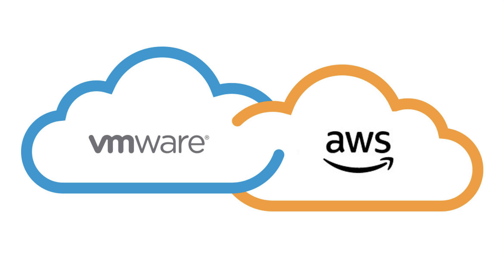

# VMWare Cloud SDDC & TKG deployment with PowerCLI and Terraform

This repository deploys a software defined data center (SDDC) on VMware Cloud on AWS and a Tanzu Community Edition cluster on top of it.

The script consists of a phased terraform deployment which creates diverse infrastructure resources such as an SDDC, NSX-T segments and policies, a VPN tunnel with your on-premises 
infrastructure, a TKG management cluster, a TKG compute cluster and a shared services cluster, where packages will be installed. 
Additionally, it deploys a VPN tunnel between the VMC vSphere environment and the VLAN
your workstation is in, which is necessary to deploy the AVI and TKG OVA/OVF Files

### Setting up the environment

1. [Install Terraform](https://learn.hashicorp.com/tutorials/terraform/install-cli)
2. [Install AWS CLI](https://docs.aws.amazon.com/cli/latest/userguide/install-cliv2-windows.html) and [add it to path](https://docs.aws.amazon.com/cli/latest/userguide/install-windows.html#awscli-install-windows-path)
3. [Install PowerCLI](https://docs.vmware.com/en/VMware-vSphere/7.0/com.vmware.esxi.install.doc/GUID-F02D0C2D-B226-4908-9E5C-2E783D41FE2D.html)
4. [Install OpenSSH Client and Server**](https://www.thomasmaurer.ch/2020/04/enable-powershell-ssh-remoting-in-powershell-7/)
5. Generate an ssh key by running `ssh-keygen -t rsa -b 2048`
6. Install [OVF tool](https://www.vmware.com/support/developer/ovf/) (might be needed for troubleshooting)


### Downloading the necessary files

1. Download the [ubuntu server cloud image OVA](https://cloud-images.ubuntu.com/focal/current/focal-server-cloudimg-amd64.ova)
   (used for the jumpbox VM) and paste it in /SDDC-Deployment/vmware/ovas
2. Open your browser and navigate to the [download page of the tanzu OVA files](https://my.vmware.com/en/group/vmware/downloads/info/slug/infrastructure_operations_management/vmware_tanzu_kubernetes_grid/1_x)
3. Clone this repo to your desired location
4. Download the [**photon-3-kube-v1.21.2+vmware.1-tkg.2-12816990095845873721.ova**](https://customerconnect.vmware.com/downloads/get-download?downloadGroup=TCE-090) and paste it in /SDDC-Deployment/vmware/ovas
5. Download the [**VMWare TCE CLI for Linux**](https://tanzucommunityedition.io/download/) and paste it in /SDDC-Deployment/vmware/tanzu


### Setting up the credentials

1. [Extract your AWS credentials:](https://registry.terraform.io/providers/hashicorp/aws/latest/docs#authentication) <br/> <br/>
   1. Select the **Command line or programmatic access** option <br/>  <br/>
    <br/>  <br/>
   1. Copy the credentials from **option 3** for further use   <br/>  <br/>
   
2. [Generate a VMware Cloud token](https://docs.vmware.com/en/VMware-Cloud-services/services/Using-VMware-Cloud-Services/GUID-E2A3B1C1-E9AD-4B00-A6B6-88D31FCDDF7C.html) (with NSX Cloud admin & administrator rights)
3. Navigate to the SDDC-Deployment/variables directory
4. Fill in your credentials in vmc_variables.csv, vpn_variables.csv, aws_variables.csv, sddc_variables.csv and tanzu_variables.csv


## 1. Deploying an SDDC in VMWare Cloud on AWS



1. Navigate to the *"SDDC-Deployment"* directory
2. Execute `.\createSDDC.ps1`

Once the SDDC is created, the terminal will prompt the three IP addresses that need to be added to the IPSec tunnel on your on-premises firewall.
Additionally, a text file was created (cgw_snat_ip.txt) which contains the Source NAT IP address of the compute network (for later use)

## 2. Deploying the jumpbox for TKGm

This script will create and configure NSX-T resources, create a IPSec VPN tunnel, upload the OVAs into vSphere and finally create and configure the jumpbox that will serve
as bootstrap machine for deploying the TCE cluster.

1. Execute `.\jumpbox-deployment.ps1`

This script executes three terraform phases: the network configuration and VPN creation,
the upload of the OVA files and the creation of the bootstrap machines.

Given that Terraform will not allow us to set some of the variables in the .tfvars file, and
requires us to set them as environmental variables, all variables will be inputed into a CSV,
and a script will

## 3. Deploying the tanzu management cluster


The previous step will finish by prompting the IP address of the deployed jumpbox. SSH into that VM by running:

`ssh -i .\ssh\id_rsa ubuntu@<JUMPBOX_IP_ADDRESS>`

Create a tanzu management cluster by running the following

 ```bash
tanzu management-cluster create --file ~/.config/tanzu/tkg/clusterconfigs/mgmt_cluster_config.yaml -v 8
 ```

### Adding the Tanzu Community Edition repository

In order to install any of the Tanzu packages, it is first necessary to add the Tanzu community edition repository:

 ```bash
tanzu package repository add tce-repo \
--url projects.registry.vmware.com/tce/main:0.9.1 \
--namespace tanzu-package-repo-global
```

Check that the repository was successfully imported:

 ```bash
tanzu package repository list -A
```

### Install cert manager on management cluster
On TKG standard version, cert-manager gets installed on the management-cluster by default, but on TCE you have to install cert-manager manually.

 ```bash
# Extract the latest available version from cert-manager
cert_manager_version=`tanzu package available list cert-manager.community.tanzu.vmware.com -A -o json | jq .[-1].version`
cert_manager_version=`sed -e 's/^"//' -e 's/"$//' <<<$cert_manager_version`

# Install cert-manager
tanzu package install cert-manager --package-name cert-manager.community.tanzu.vmware.com --version $cert_manager_version -n cert-manager --create-namespace
```

## 3. Deploying the tanzu compute cluster

Create a tanzu management cluster by running the following

 ```bash
tanzu management-cluster create --file ~/.config/tanzu/tkg/clusterconfigs/dev01_cluster_config.yaml -v 8
 ```

Create a kubeconfig in order to access your cluster:

 ```bash
tanzu cluster kubeconfig get dev01 --admin --export-file dev01.kubeconfig
 ```

Connect your workload cluster to a vSphere data store by applying the generated manifest file.

 ```bash
kubectl apply -f vsphere-storageclass.yml
 ```

Now that both the management and workload clusters have been deployed, you can [deploy a shared service cluster and install 
some of the Tanzu packages](./package_installation.md)